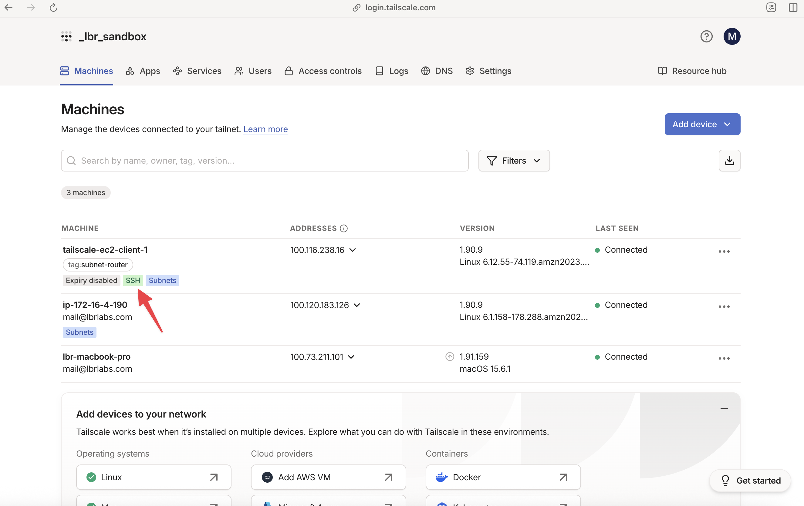
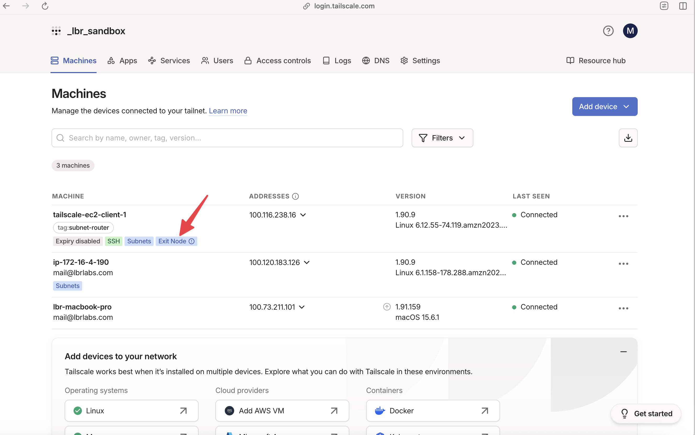
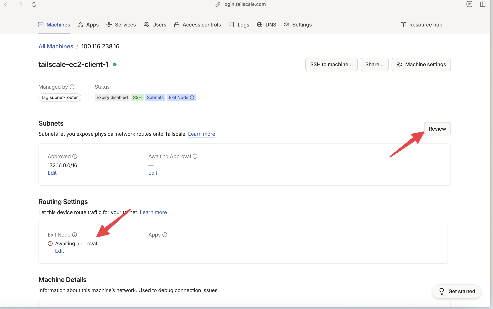
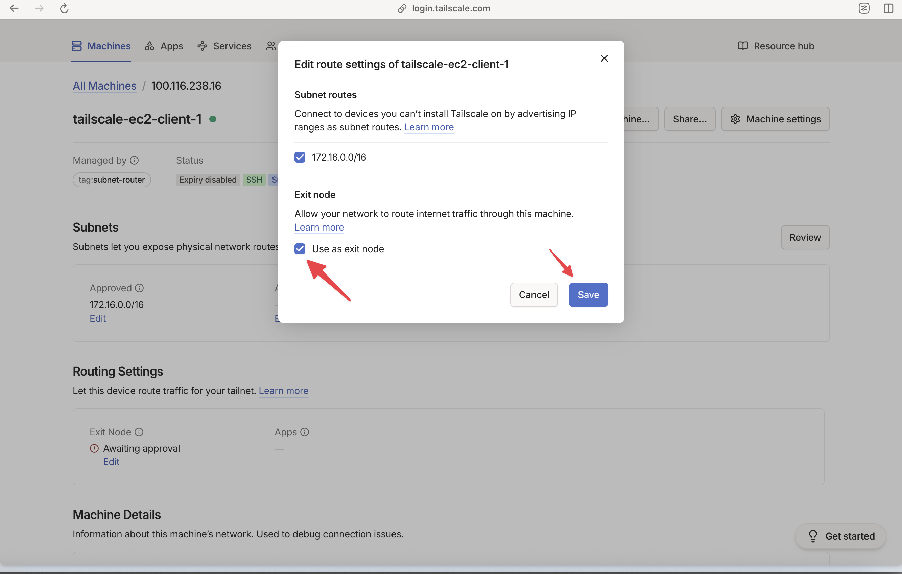
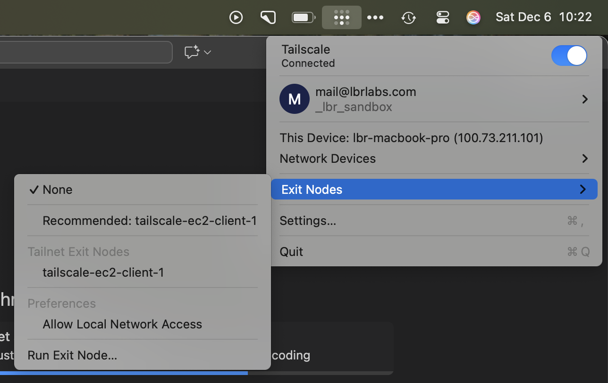

# Additional Tailscale features

We've learned the basics of Tailscale connectivity in AWS, but Tailscale can do so much more!

## Leverage Tailscale SSH

Remember the device we automated? You might have noticed earlier it had a green SSH badge in the Tailscale console:



To see what this means, let's try SSH to this device over its _Tailscale_ address:

```bash
ssh ec2-user@tailscale-ec2-client-1
tailscale: tailnet policy does not permit you to SSH to this node
Connection closed by 100.116.238.16 port 22
```

Interestingly, Tailscale has an SSH daemon built into it which we've enabled. However, we haven't configured a policy in our Tailscale ACL file to allow us access, so let's change that.

### Update the ACL

Navigate back to your ACL in the admin console, and update the `ssh` stanza like so:

```
"ssh": [
		// Allow all users to SSH into their own devices in check mode.
		// Comment this section out if you want to define specific restrictions.
		{
			"action": "check",
			"src":    ["autogroup:member"],
			"dst":    ["autogroup:self"],
			"users":  ["autogroup:nonroot", "root"],
		},
		{
			"action": "check",
			"src":    ["autogroup:admin"],
			"dst":    ["tag:subnet-router"],
			"users":  ["autogroup:nonroot", "root"],
		},
	],
```

We added the second block, which allows all admins in the tailnet to SSH to any device with the tag `subnet-router`.

Now, let's reattempt our SSH connection:

```bash
 ssh ec2-user@tailscale-ec2-client-1
# Tailscale SSH requires an additional check.
# To authenticate, visit: https://login.tailscale.com/a/l18c09a7f01962e
# Authentication checked with Tailscale SSH.
# Time since last authentication: 1s
```

?> You'll be prompted to reauthenticate here, because SSH is a privileged operation

Excellent! We can now login to devices using Tailscale SSH without needing to pass SSH keys around to devices.

## Configure an Exit Node

Our final operation here is to see how we can use Tailscale as a full tunnel. We just logged into this device, so let's configure it as an exit node.

Before we do that, let's first validate something - we want to see our public IP address. You an use `curl icanhazip.com` to see your local public IP.

```
# curl icanhazip.com
<redacted>
```

### Use `tailscale set`

We'll use our trusty `tailscale set` command to advertise this device as an exit node.

```bash
ssh ec2-user@tailscale-ec2-client-1
[ec2-user@ip-172-16-0-176 ~]$ sudo -s
[root@ip-172-16-0-176 ec2-user]# tailscale set --advertise-exit-node
```

We've added a new capability to this node, to advertise itself as an exit node. If we look at the admin console, we should see a new approval is defined:



Click on the device to be taken to the details page, and you'll see that our exit node route is awaiting approval. Hit review like we did previously for our subnet router:



Check the box, and hit save:



We now have an exit node available in our Tailnet. To use it, we need to leverage the client on our laptop. Click the Tailscale logo in your taskbar and navigate to "Exit Nodes" - you should see your AWS instance available as exit node:



Select your exit node, your Tailscale client should change in your taskbar to add an arrow:


We are now routing all of our traffic through the AWS instance! We can verify this using our previous `curl` command to the https://icanhazip.com

```bash
curl icanhazip.com
44.245.135.67
```


