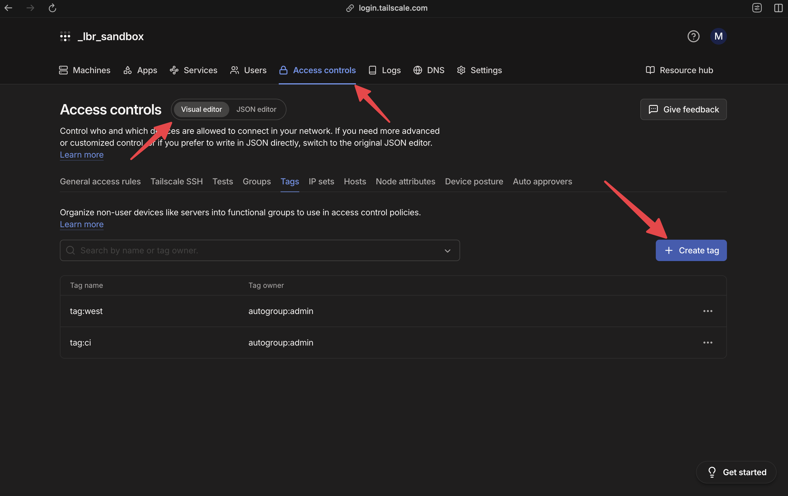
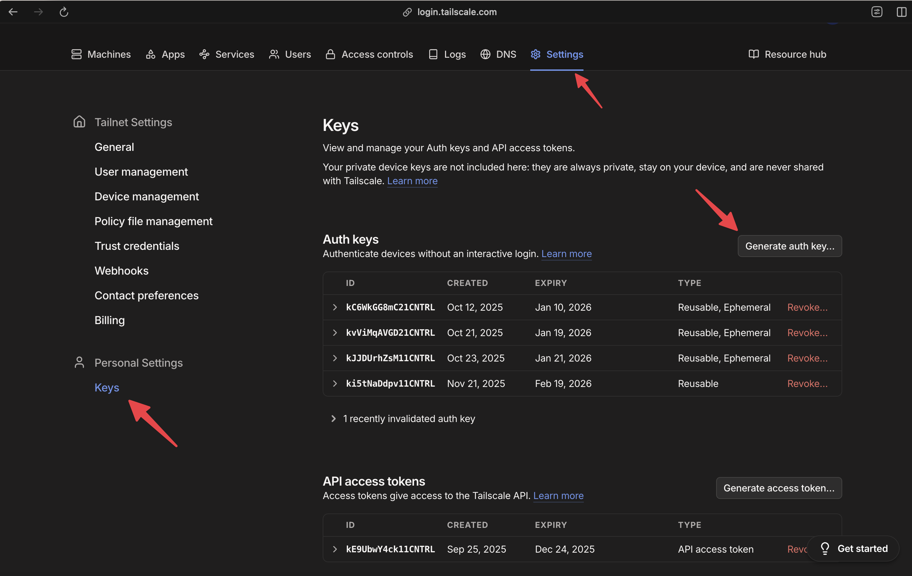
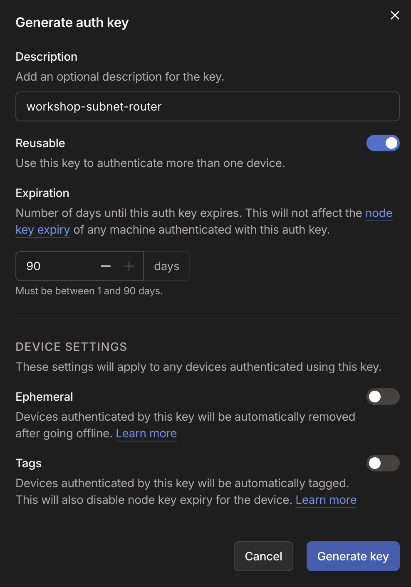

# Automating subnet router provisionining

Previously, we provisioned a subnet router on an EC2 instance manually to showcase the general way you'd get a subnet router up and running.

In most situations, you likely want to make the subnet router provision automatically. To do that, we're going to provision the subnet router with Terraform.

We can provision this subnet router alongside the existing subnet router. We'll use Terraform to do this.

## Define credentials and tags

For our previous subnet router, we authenticated Tailscale using our SSO identity. For shared infrastructure like subnet routers, we generally want to use machine based credentials. 

From the Tailscale console, we first need to define a tag in our ACL. Head to the ACL section and select the "visual editor", and hit "create tag"



Name your tag `subnet-router` and set the owner as `autogroup:admin`. 

Now we need to generate credentials for this tag that we can pass to the Tailscale client automatically. Tailscale has two mechanisms for this, auth keys and oauth clients. We'll use an auth key.


Head to "Settings" in the Tailscale console, followed by "Keys" and hit the "Generate auth key" button displayed



Now, populate the auth key settings. Ensure you make the key reusable then hit "Generate key"



A key will be displayed. **Do not close the page** as the key will not be shown again.

Now we need to define our AWS infrastructure.

## Create user data resources

Tailscale maintains a module for installing the Tailscale client using [User Data](https://docs.aws.amazon.com/AWSEC2/latest/UserGuide/user-data.html) which templates all of the CLI options. We'll use this to install Tailscale and initialize it inside our EC2 instance.

First, let's define our required Terraform variables:

```hcl
variable "architecture" {
  description = "The architecture of the AMI to use (e.g., x86_64, arm64)"
  type        = string
  default     = "x86_64"
}

variable "tailscale_auth_key" {
  description = "Tailscale authentication key"
  type        = string
  sensitive   = true
}

variable "hostname" {
  description = "Hostname for the Tailscale client"
  type        = string
  default     = "tailscale-ec2-client"
}

variable "advertise_tags" {
  description = "Tags to advertise for the subnet routers"
  type        = list(string)
  default     = []
}
```

Then, we can define our user data using the Tailscale module:

```hcl
module "amz-tailscale-client" {
  # the source of the module
  source           = "tailscale/tailscale/cloudinit"
  # the version
  version          = "0.0.9"
  # our each key
  auth_key         = var.tailscale_auth_key
  # enable SSH, we'll use this later
  enable_ssh       = true
  # define a tailscale hostname
  hostname         = var.hostname
  # tags to add to our Tailscale client
  advertise_tags   = var.advertise_tags
  # the routes we want to advertise
  advertise_routes = [local.vpc_cidr]
  # do we want to accept routes from other subnet routers?
  accept_routes    = false
  # how many times to retry
  max_retries      = 10
  # back off wait
  retry_delay      = 10
}
```

Next, we'll define an AMI to use for our EC2 instance:

```hcl
data "aws_ami" "main" {
  most_recent = true
  owners      = ["amazon"]

  filter {
    name   = "owner-alias"
    values = ["amazon"]
  }

  filter {
    name   = "architecture"
    values = [var.architecture]
  }

  filter {
    name   = "root-device-type"
    values = ["ebs"]
  }

  filter {
    name   = "name"
    values = ["al2023-ami-2023.*"]
  }
}
```

And now we'll get into the EC2 resources. We're going to define an autoscaling group for our EC2 instances, to make our subnet-router self-healing and resiliant. First, we need to define a security groups so our EC2 instance can communicate with the world:


```hcl
resource "aws_security_group" "main" {
  name_prefix = "ec2-sg-"
  vpc_id      = module.vpc.vpc_id

  ingress {
    from_port   = 22
    to_port     = 22
    protocol    = "tcp"
    cidr_blocks = ["0.0.0.0/0"]
    description = "Allow SSH access from anywhere"
  }

  ingress {
    protocol = "icmp"
    from_port = -1
    to_port = -1
    cidr_blocks = [local.vpc_cidr]
    description = "Allow ICMP from within VPC"
  }

  egress {
    from_port   = 0
    to_port     = 0
    protocol    = "-1"
    cidr_blocks = ["0.0.0.0/0"]
    description = "Allow all outbound traffic"
  }

}
```

We can also leverage our keypair from earlier, in case we need to do any debugging

```hcl
variable "key_pair_name" {
  description = "The name of the key pair to use for EC2 instances"
  type        = string
}

data "aws_key_pair" "main" {
  key_name = var.key_pair_name
}
```

Now, let's define the launch template we'll use. This will leverage our user data from our module:

```hcl

variable "instance_type" {
  description = "The instance type of the EC2 instances"
  type        = string
  default     = "t3.small"
}

resource "aws_launch_template" "main" {
  name          = var.name
  image_id      = data.aws_ami.main.id
  instance_type = var.instance_type

  block_device_mappings {
    device_name = "/dev/xvda"

    ebs {
      volume_size = var.ebs_root_volume_size
      volume_type = "gp3"
    }
  }

  user_data = module.amz-tailscale-client.rendered

  # Enforce IMDSv2
  metadata_options {
    http_endpoint = "enabled"
    http_tokens   = "required"
  }

}
```

And next, an autoscaling group that leverages that launch template

```hcl
resource "aws_autoscaling_group" "main" {
  name                = var.name
  max_size            = 1
  min_size            = 1
  desired_capacity    = 1
  health_check_type   = "EC2"
  availability_zones = []

  launch_template {
    id      = aws_launch_template.main.id
    version = aws_launch_template.main.latest_version
  }

  tag {
    key                 = "Name"
    value               = var.name
    propagate_at_launch = true
  }

  dynamic "tag" {
    for_each = var.tags

    content {
      key                 = tag.key
      value               = tag.value
      propagate_at_launch = true
    }
  }

  instance_refresh {
    strategy = "Rolling"
  }

  timeouts {
    delete = "15m"
  }
}
```

Our final manifest should look like this:

```hcl
variable "architecture" {
  description = "The architecture of the AMI to use (e.g., x86_64, arm64)"
  type        = string
  default     = "x86_64"
}

variable "tailscale_auth_key" {
  description = "Tailscale authentication key"
  type        = string
  sensitive   = true
}

variable "hostname" {
  description = "Hostname for the Tailscale client"
  type        = string
  default     = "tailscale-ec2-client"
}

variable "advertise_tags" {
  description = "Tags to advertise for the subnet routers"
  type        = list(string)
  default     = []
}

module "amz-tailscale-client" {
  source           = "tailscale/tailscale/cloudinit"
  version          = "0.0.9"
  auth_key         = var.tailscale_auth_key
  enable_ssh       = true
  hostname         = var.hostname
  advertise_tags   = var.advertise_tags
  advertise_routes = [local.vpc_cidr]
  accept_routes    = false
  max_retries      = 10
  retry_delay      = 10
}

data "aws_ami" "main" {
  most_recent = true
  owners      = ["amazon"]

  filter {
    name   = "owner-alias"
    values = ["amazon"]
  }

  filter {
    name   = "architecture"
    values = [var.architecture]
  }

  filter {
    name   = "root-device-type"
    values = ["ebs"]
  }

  filter {
    name   = "name"
    values = ["al2023-ami-2023.*"]
  }
}

variable "instance_type" {
  description = "The instance type of the EC2 instances"
  type        = string
  default     = "t3.small"
}

variable "ebs_root_volume_size" {
  description = "The size of the EBS root volume in GB"
  type        = number
  default     = 20
}

variable "key_pair_name" {
  description = "The name of the key pair to use for EC2 instances"
  type        = string
}

data "aws_key_pair" "main" {
  key_name = var.key_pair_name
}

resource "aws_security_group" "main" {
  name_prefix = "ec2-sg-"
  vpc_id      = module.vpc.vpc_id

  ingress {
    from_port   = 22
    to_port     = 22
    protocol    = "tcp"
    cidr_blocks = ["0.0.0.0/0"]
    description = "Allow SSH access from anywhere"
  }

  ingress {
    protocol = "icmp"
    from_port = -1
    to_port = -1
    cidr_blocks = [local.vpc_cidr]
    description = "Allow ICMP from within VPC"
  }

  egress {
    from_port   = 0
    to_port     = 0
    protocol    = "-1"
    cidr_blocks = ["0.0.0.0/0"]
    description = "Allow all outbound traffic"
  }

}

resource "aws_launch_template" "main" {
  name                   = var.hostname
  image_id               = data.aws_ami.main.id
  instance_type          = var.instance_type
  key_name               = data.aws_key_pair.main.key_name
  vpc_security_group_ids = [aws_security_group.main.id]

  block_device_mappings {
    device_name = "/dev/xvda"

    ebs {
      volume_size = var.ebs_root_volume_size
      volume_type = "gp3"
    }
  }

  user_data = module.amz-tailscale-client.rendered

  # Enforce IMDSv2
  metadata_options {
    http_endpoint = "enabled"
    http_tokens   = "required"
  }

}

resource "aws_autoscaling_group" "main" {
  name                = var.hostname
  max_size            = 1
  min_size            = 1
  desired_capacity    = 1
  health_check_type   = "EC2"
  vpc_zone_identifier = module.vpc.private_subnets


  launch_template {
    id      = aws_launch_template.main.id
    version = aws_launch_template.main.latest_version
  }


  instance_refresh {
    strategy = "Rolling"
  }

  timeouts {
    delete = "15m"
  }
}

```

We can now apply this. First, we need to download the module, so run:

```bash
terraform init
```

We have defined a few variables that require user input. Let's create a `terraform.tfvars` file in the same directory as your terraform code:

```hcl
# terraform vars
tailscale_auth_key = <your auth key from earlier>
key_pair_name = "lbriggs"
```

Now we can go ahead and apply this:

```bash
terraform apply
```

Confirm the prompt, and watch Terraform deploy your automatic subnet router!

You should eventually see a subnet router appear in your Tailscale console again. You'll again notice that the subnet routes need approving:


We can manually approve these routes for now, but we also want this process to be fully automated. So we'll make another change to our ACL. Head over to the "Access Control" setting in the Tailscale console:


Check that these next two images are available


Select add route as indicated, then populate the fields as shown:


Hit save. We now need to make one small change to our Terraform code. Looking at our Tailscale module, we can add a tag to our Tailscale client that will now be able to auto approve those subnets. We have already defined our variable for tags, but we default it to an empty list:


```hcl
# tags to advertise, default is []
variable "advertise_tags" {
  description = "Tags to advertise for the subnet routers"
  type        = list(string)
  default     = []
}


module "amz-tailscale-client" {
  source           = "tailscale/tailscale/cloudinit"
  version          = "0.0.9"
  auth_key         = var.tailscale_auth_key
  enable_ssh       = true
  hostname         = var.hostname
  advertise_tags   = var.advertise_tags # used here
  advertise_routes = [local.vpc_cidr]
  accept_routes    = false
  max_retries      = 10
  retry_delay      = 10
}
```

So we can simply update our `terraform.tfvars` file to add tags to our instance:

```hcl
tailscale_auth_key = "<your key>"
key_pair_name = "lbriggs"
advertise_tags = [ "tag:subnet-router" ]
```

Our auto scaling group has been configured so that if our _user data_ changes, the auto scaling group will replace the EC2 instance for us. We can see that in action in the Autoscaling group section of the AWS console


After waiting a few moments, we can now see in our Tailscale console a new EC2 instance:


You'll notice, the routes were already approved! No need to manually approve them.

We now have a fully automated EC2 subnet router, which is reliant to failures. We could also increase the number of instances in the autoscaling group to ensure high availability by simply changing the number of instances in Terraform like so:

```hcl
resource "aws_autoscaling_group" "main" {
  name                = var.hostname
  max_size            = 2 # change to 2
  min_size            = 2 # change to 2
  desired_capacity    = 2 # change to 2
  health_check_type   = "EC2"
  vpc_zone_identifier = module.vpc.private_subnets


  launch_template {
    id      = aws_launch_template.main.id
    version = aws_launch_template.main.latest_version
  }


  instance_refresh {
    strategy = "Rolling"
  }

  timeouts {
    delete = "15m"
  }
}
```

This completes our automated section, congratulations!


