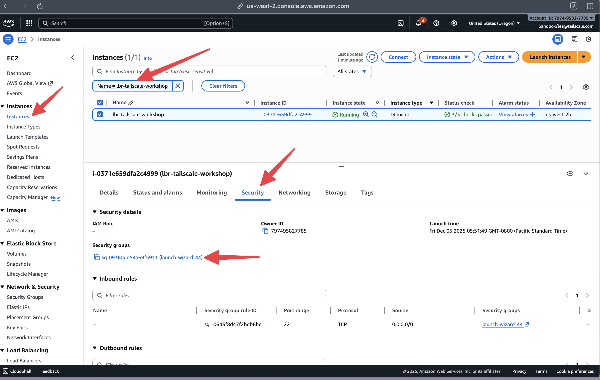
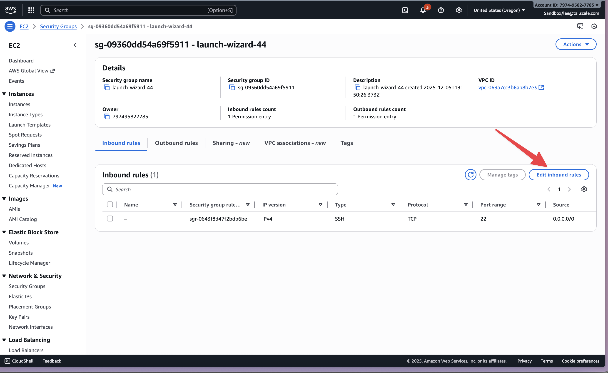
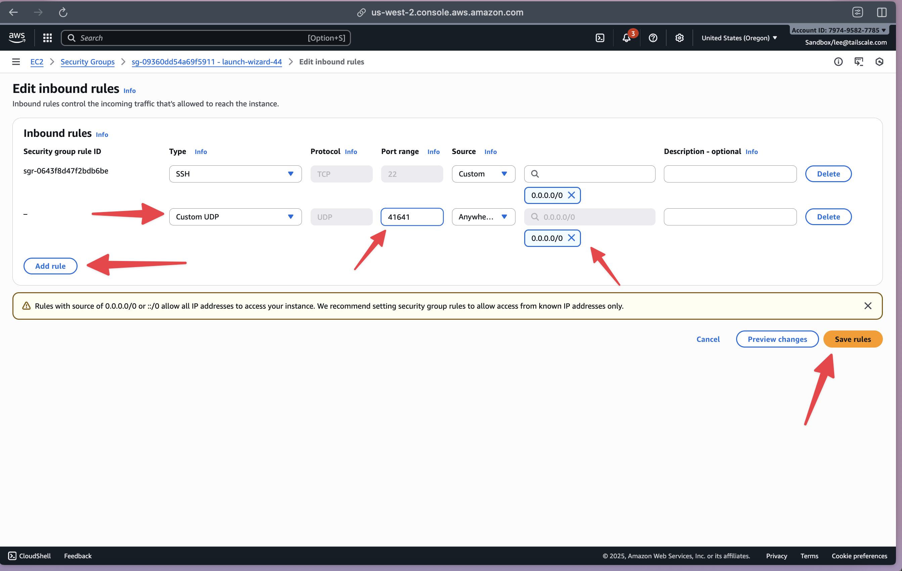

# Connectivity Testing

We now have 2 Tailscale hosts in our tailnet, with one key difference. One of the instances is in the _private_ subnet and one of them is in the _public_ subnet.

From our Tailscale client on our laptop, we can retrieve the hostnames and addresses of all the clients in our tailnet either from the admin console, or from the Tailscale CLI:

?> You'll need to ensure the tailscale CLI is accessible from your local machine, see [here](https://tailscale.com/kb/1080/cli?tab=windows#using-the-tailscale-cli) for details

```bash
# tailscale status
100.73.211.101   lbr-macbook-pro         mail@           macOS  -  
100.120.183.126  ip-172-16-4-190         mail@           linux  -  
100.116.238.16   tailscale-ec2-client-1  tagged-devices  linux  -  
```

We can access these devices using either their Tailscale IP, which is assigned out of the [Carrier Grade NAT](https://en.wikipedia.org/wiki/Carrier-grade_NAT) address space, or using their hostname using [MagicDNS](https://tailscale.com/kb/1081/magicdns).

Let's use the standard ping command to verify we have [ICMP](https://en.wikipedia.org/wiki/Internet_Control_Message_Protocol) connectivity:

```bash
ping -c 1 100.120.183.126
PING 100.120.183.126 (100.120.183.126): 56 data bytes
64 bytes from 100.120.183.126: icmp_seq=0 ttl=127 time=27.849 ms

--- 100.120.183.126 ping statistics ---
1 packets transmitted, 1 packets received, 0.0% packet loss
round-trip min/avg/max/stddev = 27.849/27.849/27.849/0.000 ms
```

```bash
ping -c 1 tailscale-ec2-client-1
PING tailscale-ec2-client-1.tail4cf751.ts.net (100.116.238.16): 56 data bytes
64 bytes from 100.116.238.16: icmp_seq=0 ttl=127 time=149.390 ms

--- tailscale-ec2-client-1.tail4cf751.ts.net ping statistics ---
1 packets transmitted, 1 packets received, 0.0% packet loss
round-trip min/avg/max/stddev = 149.390/149.390/149.390/0.000 ms
```

Now, the eagle eyed might notice here that despite these instances being connected to us over Tailscale in the same VPC, they latency (ie, the `time` output) is very different. We'll now examine why that is, and what we can do about it:

## Direct v Relayed Connections

Tailscale endeavours to connect devices together directly. In situations where it cannot create a direct connection, Tailscale uses [relayed connections](https://tailscale.com/kb/1257/connection-types#relayed-connections) to bridge the gap. These relayed connections route through a [DERP server](https://tailscale.com/kb/1232/derp-servers) and can additional latency and limit throughput.

The easiest way to check what sort of connection you're getting is using the `tailscale ping` command. Let's see the state of the connection to both our AWS devices:

?> **Note** Your connection test results may vary from the examples shown here. Factors like your local network configuration, ISP, and geographic location all influence the connection path between your machine and AWS. 

The instance we deployed to a private subnet only:

```bash
tailscale ping tailscale-ec2-client-1
pong from tailscale-ec2-client-1 (100.116.238.16) via DERP(sea) in 32ms
pong from tailscale-ec2-client-1 (100.116.238.16) via DERP(sea) in 28ms
pong from tailscale-ec2-client-1 (100.116.238.16) via DERP(sea) in 27ms
pong from tailscale-ec2-client-1 (100.116.238.16) via DERP(sea) in 30ms
pong from tailscale-ec2-client-1 (100.116.238.16) via DERP(sea) in 29ms
pong from tailscale-ec2-client-1 (100.116.238.16) via DERP(sea) in 26ms
pong from tailscale-ec2-client-1 (100.116.238.16) via DERP(sea) in 41ms
pong from tailscale-ec2-client-1 (100.116.238.16) via DERP(sea) in 28ms
pong from tailscale-ec2-client-1 (100.116.238.16) via DERP(sea) in 32ms
pong from tailscale-ec2-client-1 (100.116.238.16) via DERP(sea) in 30ms
2025/12/06 09:21:05 direct connection not established
```

You'll see the `via` part of the connection here - Tailscale is telling us our connection is relayed. Now let's see the instance we deployed in a public subnet:

```bash
tailscale ping ip-172-16-4-190
pong from ip-172-16-4-190 (100.120.183.126) via DERP(sea) in 30ms
pong from ip-172-16-4-190 (100.120.183.126) via 18.237.116.163:41641 in 28ms
```

What's interesting here is that our connection _started_ relayed and then eventually got upgraded to a direct connection. Subsequent attempts should be direct immediately:

```bash
tailscale ping ip-172-16-4-190
pong from ip-172-16-4-190 (100.120.183.126) via 18.237.116.163:41641 in 31ms
```

There are steps we can take to ensure we always get direct connections to instances. The first one is to ensure the Tailscale port is accessible:

## Open the security group

Track down the EC2 instance we created with the console earlier, and navigate to the security tab:



You can click on the security group we created earlier when we created the instance to add a rule:



Now, add the rule to open the UDP port for Tailscale:



Hit save, and you're done.

## Retest

After time passes, Tailscale tears down the connection between two devices to protect battery life and limit data transfer. You can verify this by using `tailscale status`

```bash
tailscale status
100.73.211.101   lbr-macbook-pro         mail@           macOS  -                    
100.120.183.126  ip-172-16-4-190         mail@           linux  idle, tx 936 rx 696  
100.116.238.16   tailscale-ec2-client-1  tagged-devices  linux  idle, tx 840 rx 568  
```

The `idle` there indicates we have previously sent packets to a device, but the connection is currently idle.

We should now run _another_ `tailscale ping`

```bash
tailscale ping ip-172-16-4-190
pong from ip-172-16-4-190 (100.120.183.126) via 18.237.116.163:41641 in 33ms
```

We're now getting _immediate_ direct connections to our instance! Assigning a public IP address and opening UDP port 41641 is the most reliable way to ensure a Tailscale client always establishes high-performance, direct connections.

But what about clients that _must_ remain in a private subnet without public internet access? In the next section, we'll configure this public instance as a relay peer to provide direct connections for those private clients.


