# Provision a Tailscale Subnet Router

We're going to manually provision a subnet router using the EC2 console so we can see all of the steps involved.

First, we need to create the instance. Navigate to the EC2 console by searching for EC2 in the search bar

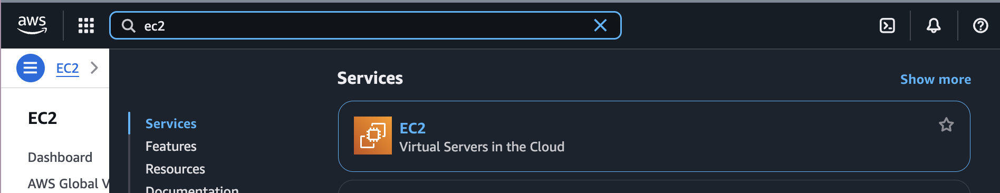

Hit the **Launch Instance** button

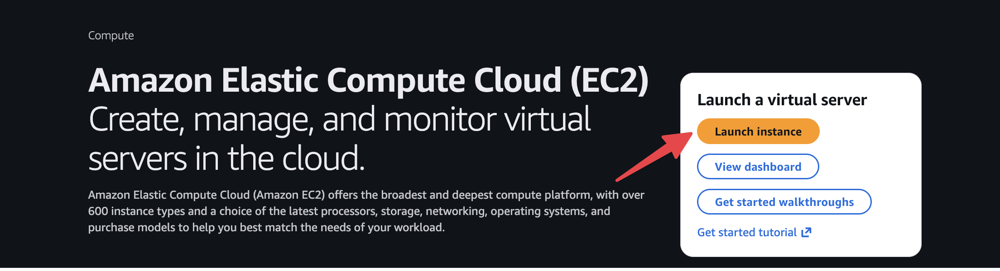

Now we need to fill out all the details.

Add a name

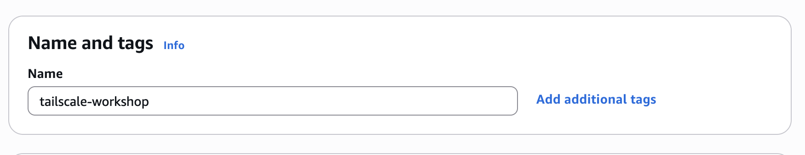

Choose an AMI

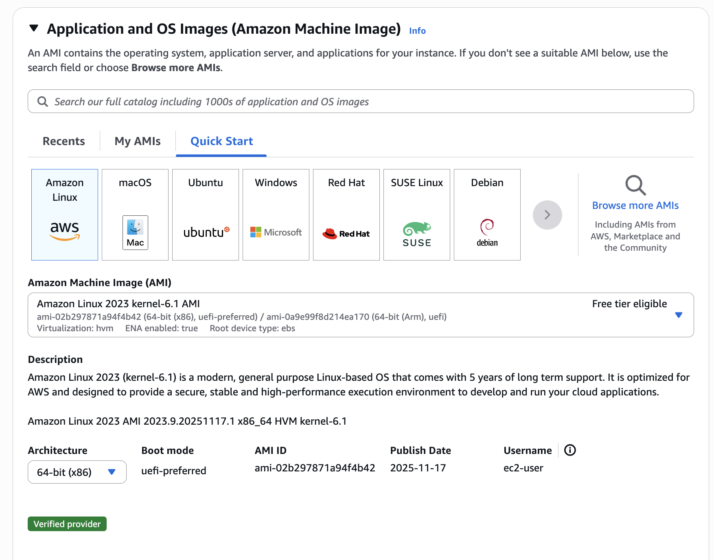

Add a keypair - we'll need this to get access to the instance to provision Tailscale!

<mark>Note: you may need to upload or generate a keypair</mark>

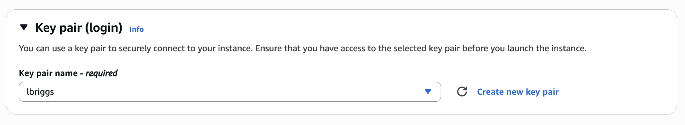

In the networking section, select the VPC you created earlier and ensure you place the instance in a **public** subnet.

You'll also need to set the **Auto-assign public IP** setting to **Enable**

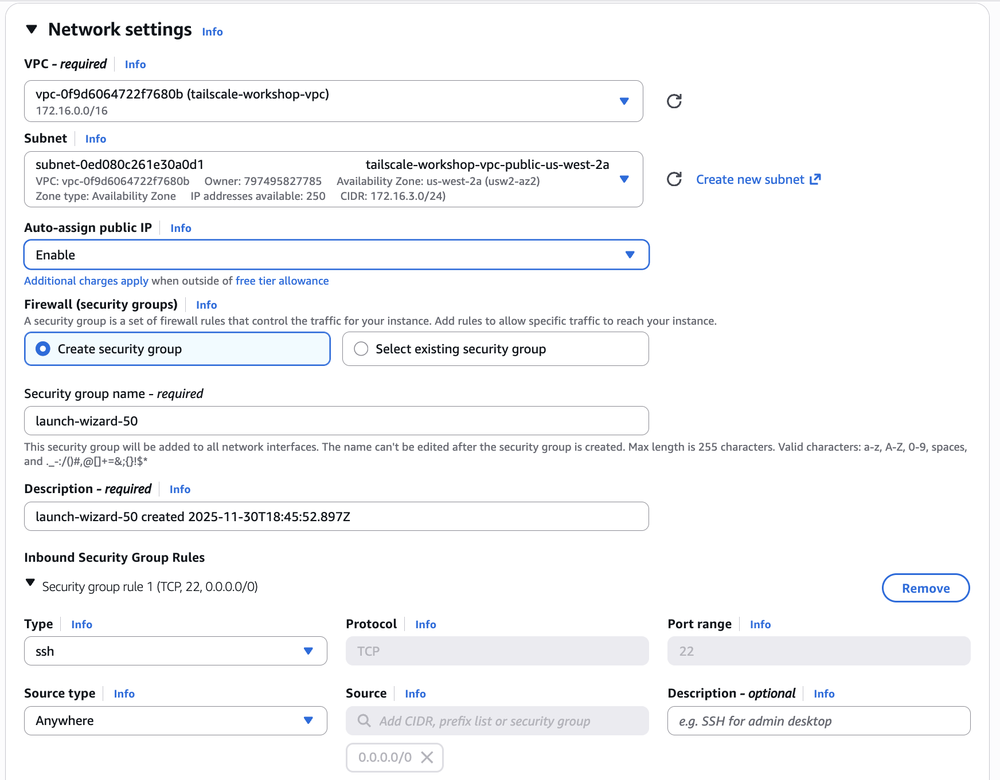

Now, verify all your settings and hit the **Launch Instance** button on the right hand side

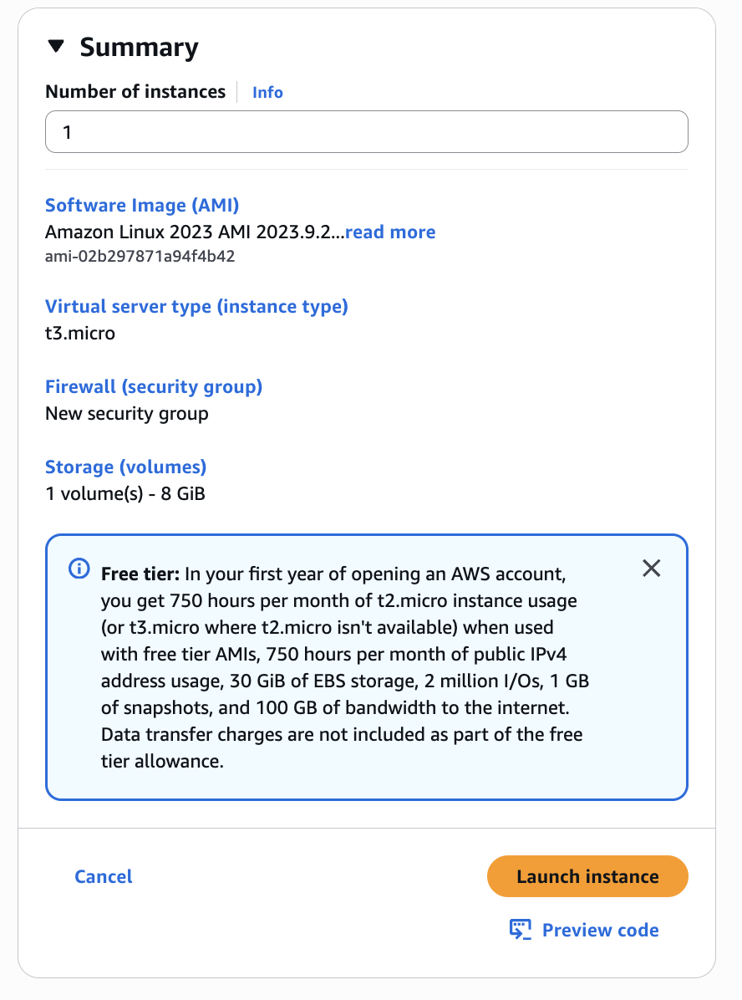

Your instance should launch and you should see a success page. You can click the instance ID on the subsequent page to head over to your EC2 instance

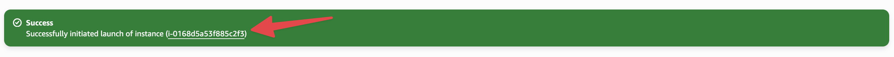

Now, you're looking for the public IPv4 that was assigned to your instance. Copy this, and we can head to the next step

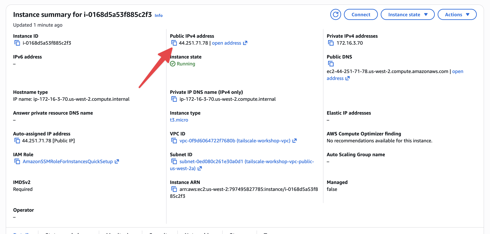

# Login to the instance

We now have a public instance with SSH access enabled which we can install Tailscale on. Let's login to the instance.

You'll need to private key from the keypair you provisioned earlier. The private key needs to have the correct permissions and you need to know the path to it.

We'll login to the instance like so:

```bash
ssh -i ~/path/to/private/key.pem ec2-user@<public-ip>
```

You should see a message like this

```bash
The authenticity of host '44.251.71.78 (44.251.71.78)' can't be established.
ED25519 key fingerprint is SHA256:NhcNhqChMIWtBw8r/VO1VnLKqG4Zq9TndRrb1UVP914.
This key is not known by any other names.
Are you sure you want to continue connecting (yes/no/[fingerprint])? 
```

Type `yes`

And you'll be dropped into a shell on the remote host.

Now, switch to the root user

```bash
sudo -s
```

And let's install Tailscale!

# Install Tailscale

You can use Tailscale's [install script](https://tailscale.com/kb/1031/install-linux) - run the following command:

```bash
curl -fsSL https://tailscale.com/install.sh | sh
```

This script handles:

- Downloading the Tailscale package for your operating system, adding the required packages from the native operating system package manager
- Installing those packages, which include the `tailscaled` daemon service, the Tailscale CLI and all of the required operating system permissions

You can verify this process worked by validating the following binaries exist:

Run `tailscaled --help` and see the output from `tailscaled`

```bash
# tailscaled --help
```

Run `tailscale --version` to see the version of the CLI and daemon installed

```bash
tailscale --version
1.90.9
  tailscale commit: 6e8a4f2de795ae6801f4b599e3f64ca6b5465c01
  long version: 1.90.9-t6e8a4f2de-g19196f361
  other commit: 19196f3617f75c3898c4fdfd4e82dcf9d258a04b
  go version: go1.25.3
```

# Authenticate Tailscale

Now, we'll authenticate Tailscale so it becomes a part of your tailnet.

Simply run `tailscale up` and Tailscale will prompt you to login via a URL

```bash
root@ip-172-16-3-70 ec2-user]# tailscale up

To authenticate, visit:

	https://login.tailscale.com/a/8e210c101057c
```

Visit this URL in your browser from your laptop, and you'll see a success message printed in the console


```bash
Success.
```

Now, run `tailscale netcheck` from the instance:

```bash
[root@ip-172-16-3-70 ec2-user]# tailscale status
100.96.0.1      ip-172-16-3-70   mail@  linux  -  
100.73.211.101  lbr-macbook-pro  mail@  macOS  -  
```

You should see your new instance and any other machine in your tailnet. Congratulations, you've authenticated the device!

# Converting to Subnet Router

This particular machine is now on the tailnet, but we have more work to do. We want to use this machine as a router to a access our RDS machine from earlier. First, let's check this EC2 instance has access to the RDS database from earlier. You can grab the RDS database's URL from your Terraform run earlier, using `terraform output`

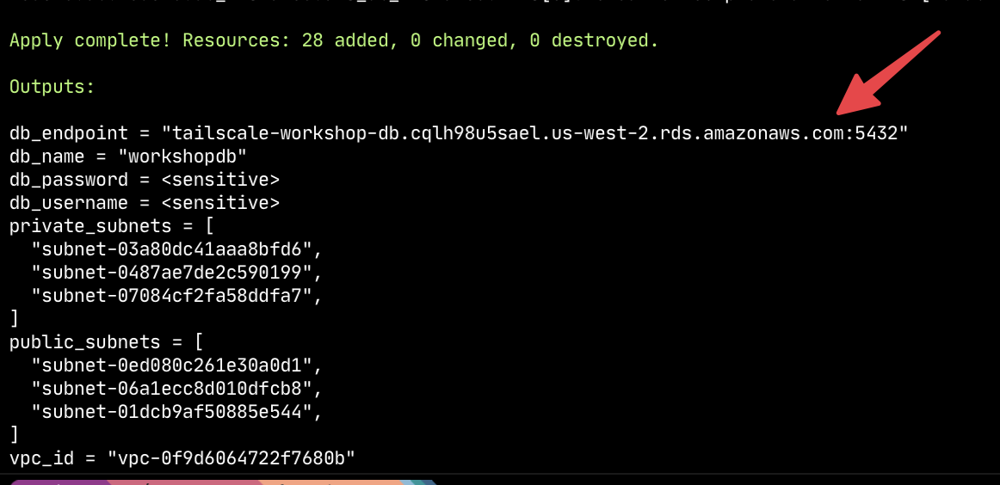

**From the EC2 instance** let's verify our EC2 instance can access the RDS database. We can use `netcat` for that. Netcat is a very useful networking connectivity debugging tool. Let's install that and another useful tool:


```bash
yum install tcptraceroute nmap-ncat
```

Now, let's use netcat to verify we have access to our RDS database - this doesn't actually do any logins, just verifies that we have access to the open port:

```bash
nc -v tailscale-workshop-db.cqlh98u5sael.us-west-2.rds.amazonaws.com 5432
Ncat: Version 7.93 ( https://nmap.org/ncat )
Ncat: Connected to 172.16.0.234:5432.
```

See that `Connected to` message? That verifies we have access to our RDS database _from_ the EC2 instance.

Now, we can leverage Tailscale to give out _laptop_ access to this instance. On the EC2 instance, run the following command:

## Enable IP Forwarding

The first thing we need to do is enable IP forwarding on the subnet-router. This is a Linux capability that allows the machine to forward packets to another machine. You can do this on the EC2 instance by running the following commands:

```bash
echo 'net.ipv4.ip_forward = 1' | sudo tee -a /etc/sysctl.d/99-tailscale.conf
echo 'net.ipv6.conf.all.forwarding = 1' | sudo tee -a /etc/sysctl.d/99-tailscale.conf
sudo sysctl -p /etc/sysctl.d/99-tailscale.conf
```

## Advertise Routes

```bash
[root@ip-172-16-3-70 ec2-user]# tailscale set --advertise-routes 172.16.0.0/16
```

This command has enabled "subnet routing" mode on the EC2 instance. It is now advertising the routes to all of the other nodes in the tailnet.

If you head to your Tailscale admin console, you should see something like this

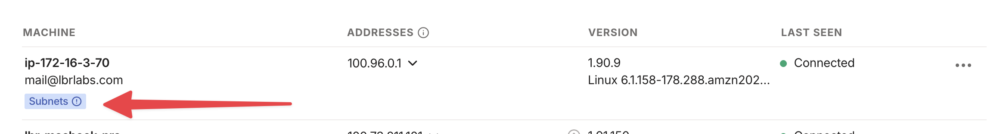

However over the badge, and you'll see a message like this:

> This machine has unapproved routes. Review this from the “Edit route settings...” option in the machine’s menu.

Navigate into the machine by clicking on it, and you'll see the following

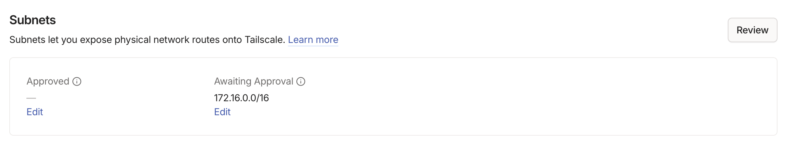

Select **Edit** and you'll see a page like this:

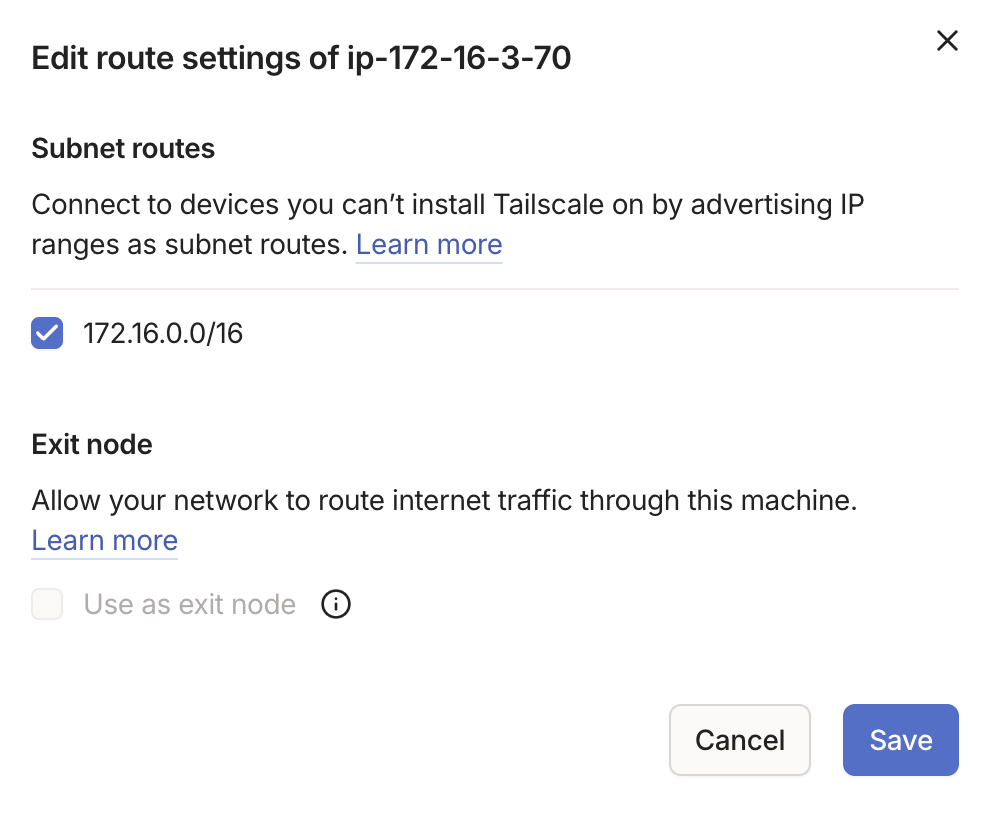

Select the checkbox to approve the route and hit **Save**.

The route has now been approved for the Tailnet. 

## Verify Connectivity

Now, we have a subnet-router inside the VPC that is advertising the VPC's subnet range to your local machine. You should now be able to connect to the RDS database locally!

You can verify with `netcat` again:

```bash
nc -v tailscale-workshop-db.cqlh98u5sael.us-west-2.rds.amazonaws.com 5432
Connection to tailscale-workshop-db.cqlh98u5sael.us-west-2.rds.amazonaws.com port 5432 [tcp/postgresql] succeeded!
```

You are now connected to an RDS database in AWS that lives in a private subnet, with no public accessibility!


